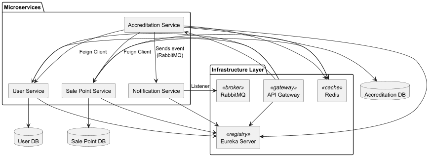

# 🌐 Microservices Platform - Java Tribe Challenge


## 📘 Language Directory

- [English Version](#-readme-english)
- [Versión en Español](#-readme-español)


## 🇬🇧 README (English)

This repository hosts a microservices-based ecosystem built for Accenture's Java Tribe challenge. It includes various services responsible for user management, sale points, accreditations, notifications, routing, and service discovery.

---

### 📂 Directory / Directorio

- [`user-microservice`](./user-microservice) - User registration, login, and role management 
- [`sale-point-service`](./sale-point-service) - Sale point and cost connection management 
- [`accreditation-service`](./accreditation-service) - Order registration and asynchronous email events
- [`notification-service`](./notification-service) - Email sending with PDF generation 
- [`api-gateway`](./api-gateway) - Routes, authentication, internal/external filtering
- [`eureka-server`](./eureka-server) - Service discovery and registration

---

### Microservices Architecture



---

### 🧰 Technology Stack

- Java 21
- Maven 3.9+
- Spring Boot 3.2+
- Spring Mail (for email sending)
- Spring Security + JWT (for authentication and authorization)
- Spring JPA (for persistence)
- Eureka Server (discovery)
- Spring Cloud Gateway (routing)
- PostgreSQL and H2 Database (for databases)
- OpenFeign (for inter-service communication via synchronous REST calls)
- RabbitMQ (for messaging and asynchronous events)
- Redis (for caching)
- Podman/Docker - Podman/Docker Compose (for deployment)
- iText (for PDF generation)
- Java Mail Sender (for email sending)
- Lombok (for boilerplate code reduction)
- SonarQube + Jacoco (for code quality reports)
- JUnit 5 + Mockito (for testing)

---

### 🧩 Microservices Overview

| Microservice         | Description                                      | Link                                             |
|----------------------|--------------------------------------------------|--------------------------------------------------|
| User Service         | Handles registration, login, and role logic.     | [README](https://github.com/kirii626/user-microservice/blob/main/README.md)          |
| Sale Point Service   | Sale point CRUD and cost-based graph logic.      | [README](https://github.com/kirii626/sale-point-microservice/blob/main/README.md)    |
| Accreditation Service| Registers orders and triggers email via Rabbit.  | [README](https://github.com/kirii626/accreditation-microservice/blob/main/README.md) |
| Notification Service | Listens and sends email with PDFs (iText).       | [README](https://github.com/kirii626/notification-service/blob/main/README.md)  |
| API Gateway          | Validates JWT and routes external/internal calls.| [README](https://github.com/kirii626/api-gateway/blob/main/README.md)                |
| Eureka Server        | Service discovery via Spring Netflix Eureka.     | [README](https://github.com/kirii626/eureka-server/blob/main/README.md)              |

---

### Define Environment Variables

Create a `.env` file in the root directory with the following variables:

```env
#Ports of microservices
EUREKA_SERVER_PORT=your-eureka-server-port
GATEWAY_PORT=your-gateway-port
ACCREDITATION_SERVICE_PORT=your-accreditation-service-port
SALE_POINT_PORT=your-sale-point-service-port
USER_SERVICE_PORT=your-user-service-port
NOTIFICATION_PORT=your-notification-service-port

#Eureka client service url
EUREKA_CLIENT_SERVICE_URL=http://eureka-server:your-eureka-server-port/eureka

#Sale point service url
SALE_POINT_SERVICE_URL=http://sale-point-service:your-sale-point-service-port/api/sale-point/admin/internal-use

#User service url
USER_ADMIN_SERVICE_URL=http://user-service:your-user-service-port/api/user/admin/internal-use

#DB config accreditation-db
ACCREDITATION_DB_USER=your_accreditation_user
ACCREDITATION_DB_PASSWORD=your_accreditation_pass
ACCREDITATION_SPRING_DATASOURCE_URL=jdbc:postgresql://accreditation-db:your-db-port/accreditationdb
ACCREDITATION_SPRING_DATASOURCE_USERNAME=${ACCREDITATION_DB_USER}
ACCREDITATION_SPRING_DATASOURCE_PASSWORD=${ACCREDITATION_DB_PASSWORD}

#DB config salepoint-db
SALEPOINT_DB_USER=your_salepoint_user
SALEPOINT_DB_PASSWORD=your_salepoint_pass
SALEPOINT_SPRING_DATASOURCE_URL=jdbc:postgresql://salepoint-db:your-db-port/salepointdb
SALEPOINT_SPRING_DATASOURCE_USERNAME=${SALEPOINT_DB_USER}
SALEPOINT_SPRING_DATASOURCE_PASSWORD=${SALEPOINT_DB_PASSWORD}

#DB config user-db
USER_DB_USER=your_user_user
USER_DB_PASSWORD=your_user_pass
USER_SPRING_DATASOURCE_URL=jdbc:postgresql://user-db:your-db-port/userdb
USER_SPRING_DATASOURCE_USERNAME=${USER_DB_USER}
USER_SPRING_DATASOURCE_PASSWORD=${USER_DB_PASSWORD}

# Notification service config (RabbitMQ + Email)

# RabbitMQ
RABBITMQ_HOST=rabbitmq
RABBITMQ_PORT=your-rabbitmq-port
RABBITMQ_USERNAME=your_rabbitmq_user
RABBITMQ_PASSWORD=your_rabbitmq_pass

# RabbitMQ bindings
ACCREDITATION_EXCHANGE=accreditation.exchange
RABBITMQ_ROUTINGKEY_ACCREDITATION=rabbitmq.routingkey.accreditation
RABBITMQ_QUEUE_ACCREDITATION=rabbitmq.queue.accreditation

# Email settings (notification sender)
SPRING_MAIL_USERNAME=your-email
SPRING_MAIL_PASSWORD=your-email-password

INTERNAL_SECRET_TOKEN=your_internal_secret_token

# JWT settings
JWT_EXPIRATION=your_jwt_expiration_time # e.g., 3600 for 1 hour
JWT_SECRET=your_jwt_secret_key # must be a 64 base encoded string with at least 32 characters

# Redis settings
SPRING_REDIS_HOST=redis
SPRING_REDIS_PORT=your-redis-port
```

---

### 📦 Running the Project

>Launch each service in order or use the docker-compose.yml for build and run all the containers together within the same network.
> First, ensure you have Podman/Docker and Podman/Docker Compose installed.
> Then, define the environment variables in a `.env` file or directly in your terminal.
> To run the project, execute:

Podman Compose commands:
```bash
podman compose build 
```
```bash
podman compose up
```

Docker Compose commands:
```bash
docker-compose build
```
```bash
docker-compose up
```

---

### 🔐 Security

- JWT-based authentication
- Internal token headers
- Role-based access

---

### 📊 Quality

- SonarQube & JaCoCo integrated in each service.
- Coverage targets met > 70% in key services.

---

# 🧭 Plataforma de Microservicios - Reto Java Tribe

## 🇪🇸 README (Español)


Este repositorio alberga un ecosistema basado en microservicios construido para el desafío técnico de la Tribu Java de Accenture. Incluye varios servicios responsables de la gestión de usuarios, puntos de venta, acreditaciones, notificaciones, ruteo y descubrimiento de servicios.

---

### 📂 Directorio 
- [`user-microservice`](./user-microservice) - Registro de usuarios, login y gestión de roles
- [`sale-point-microservice`](./sale-point-service) - Gestión de puntos de venta y conexiones de costos
- [`accreditation-microservice`](./accreditation-service) - Registro de órdenes y eventos asíncronos de correo
- [`notification-microservice`](./notification-service) - Envío de correos con generación de PDFs
- [`api-gateway`](./api-gateway) - Rutas, autenticación, filtrado interno/externo
- [`eureka-server`](./eureka-server) - Descubrimiento y registro de servicios

---

### Arquitectura de Microservicios


---

### 🧰 Stack Tecnológico

- Java 21
- Maven 3.9+
- Spring Boot 3.2+
- Spring Mail (para envío de correos)
- Spring Security + JWT (para autenticación y autorización)
- Spring JPA (para persistencia)
- Eureka Server (descubrimiento de servicios)
- Spring Cloud Gateway (para ruteo)
- PostgreSQL and H2 Database (para bases de datos)
- OpenFeign (para comunicación sincronica entre servicios vía REST)
- RabbitMQ (para mensajería y eventos asíncronos)
- Redis (para caché)
- Podman/Docker - Podman/Docker Compose (para despliegue)
- iText (para generación de PDFs)
- Java Mail Sender (para envío de correos)
- Lombok (para reducción de boilerplate)
- SonarQube + Jacoco (para generación de informes de calidad de código)
- JUnit 5 + Mockito (para pruebas unitarias)

---

### 🧩 Descripción de Microservicios

| Microservicio        | Función principal                                | Enlace                                           |
|----------------------|--------------------------------------------------|--------------------------------------------------|
| Servicio de Usuarios | Registro, login y gestión de roles.              | [README](https://github.com/kirii626/user-microservice/blob/main/README.md)          |
| Puntos de Venta      | CRUD de puntos y grafo de costos.                | [README](https://github.com/kirii626/sale-point-microservice/blob/main/README.md)    |
| Acreditaciones       | Crea órdenes y envía notificaciones.             | [README](https://github.com/kirii626/accreditation-microservice/blob/main/README.md) |
| Notificaciones       | Recibe eventos y envía emails con PDFs.          | [README](https://github.com/kirii626/notification-service/blob/main/README.md)  |
| API Gateway          | Valida JWT y redirige llamadas internas/externas.| [README](https://github.com/kirii626/api-gateway/blob/main/README.md)                |
| Eureka Server        | Descubrimiento de servicios con Spring Netflix.  | [README](https://github.com/kirii626/eureka-server/blob/main/README.md)              |

---

### Definir Variables de Entorno

Crea un archivo `.env` en el directorio raíz con las siguientes variables:

```env
#Ports of microservices
EUREKA_SERVER_PORT=your-eureka-server-port
GATEWAY_PORT=your-gateway-port
ACCREDITATION_SERVICE_PORT=your-accreditation-service-port
SALE_POINT_PORT=your-sale-point-service-port
USER_SERVICE_PORT=your-user-service-port
NOTIFICATION_PORT=your-notification-service-port

#Eureka client service url
EUREKA_CLIENT_SERVICE_URL=http://eureka-server:your-eureka-server-port/eureka

#Sale point service url
SALE_POINT_SERVICE_URL=http://sale-point-service:your-sale-point-service-port/api/sale-point/admin/internal-use

#User service url
USER_ADMIN_SERVICE_URL=http://user-service:your-user-service-port/api/user/admin/internal-use

#DB config accreditation-db
ACCREDITATION_DB_USER=your_accreditation_user
ACCREDITATION_DB_PASSWORD=your_accreditation_pass
ACCREDITATION_SPRING_DATASOURCE_URL=jdbc:postgresql://accreditation-db:your-db-port/accreditationdb
ACCREDITATION_SPRING_DATASOURCE_USERNAME=${ACCREDITATION_DB_USER}
ACCREDITATION_SPRING_DATASOURCE_PASSWORD=${ACCREDITATION_DB_PASSWORD}

#DB config salepoint-db
SALEPOINT_DB_USER=your_salepoint_user
SALEPOINT_DB_PASSWORD=your_salepoint_pass
SALEPOINT_SPRING_DATASOURCE_URL=jdbc:postgresql://salepoint-db:your-db-port/salepointdb
SALEPOINT_SPRING_DATASOURCE_USERNAME=${SALEPOINT_DB_USER}
SALEPOINT_SPRING_DATASOURCE_PASSWORD=${SALEPOINT_DB_PASSWORD}

#DB config user-db
USER_DB_USER=your_user_user
USER_DB_PASSWORD=your_user_pass
USER_SPRING_DATASOURCE_URL=jdbc:postgresql://user-db:your-db-port/userdb
USER_SPRING_DATASOURCE_USERNAME=${USER_DB_USER}
USER_SPRING_DATASOURCE_PASSWORD=${USER_DB_PASSWORD}

# Notification service config (RabbitMQ + Email)

# RabbitMQ
RABBITMQ_HOST=rabbitmq
RABBITMQ_PORT=your-rabbitmq-port
RABBITMQ_USERNAME=your_rabbitmq_user
RABBITMQ_PASSWORD=your_rabbitmq_pass

# RabbitMQ bindings
ACCREDITATION_EXCHANGE=accreditation.exchange
RABBITMQ_ROUTINGKEY_ACCREDITATION=rabbitmq.routingkey.accreditation
RABBITMQ_QUEUE_ACCREDITATION=rabbitmq.queue.accreditation

# Email settings (notification sender)
SPRING_MAIL_USERNAME=your-email
SPRING_MAIL_PASSWORD=your-email-password

INTERNAL_SECRET_TOKEN=your_internal_secret_token

# JWT settings
JWT_EXPIRATION=your_jwt_expiration_time # e.g., 3600 for 1 hour
JWT_SECRET=your_jwt_secret_key # must be a 64 base encoded string with at least 32 characters

# Redis settings
SPRING_REDIS_HOST=redis
SPRING_REDIS_PORT=your-redis-port
```

---

### 📦 Ejecución del Proyecto

> Lanza cada servicio en orden o usa el `docker-compose.yml` para construir y ejecutar todos los contenedores juntos dentro de la misma red.
> Primero, asegúrate de tener Podman/Docker y Podman/Docker Compose instalados.
> Luego, define las variables de entorno en un archivo `.env` o directamente en tu terminal.
> Para ejecutar el proyecto, ejecuta:

Podman Compose commands:
```bash
podman compose build 
```
```bash
podman compose up
```

Docker Compose commands:
```bash
docker-compose build
```
```bash
docker-compose up
```

---

### 🔐 Seguridad

- Autenticación JWT
- Cabeceras internas
- Control por roles(ADMIN, USER)

---

### 📊 Calidad

- Integración de SonarQube y JaCoCo en cada servicio.
- Cobertura superior al 70% en los servicios principales.
